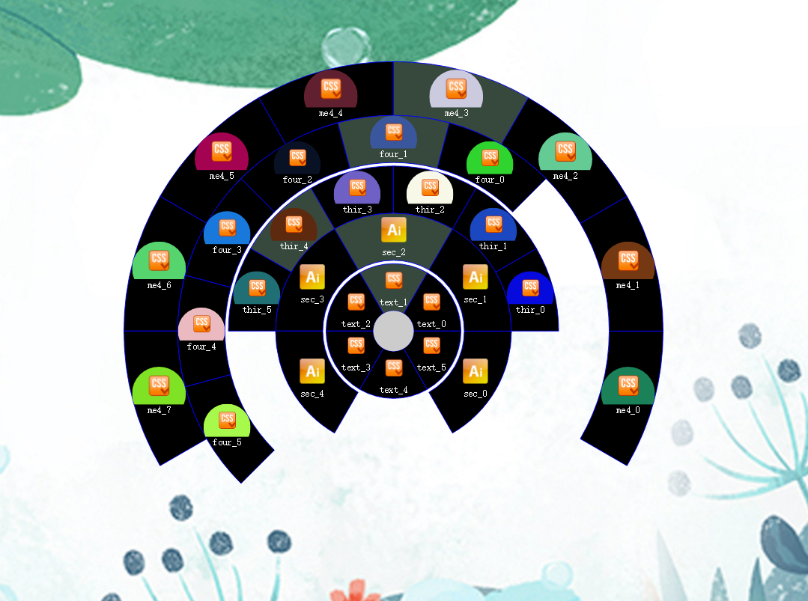
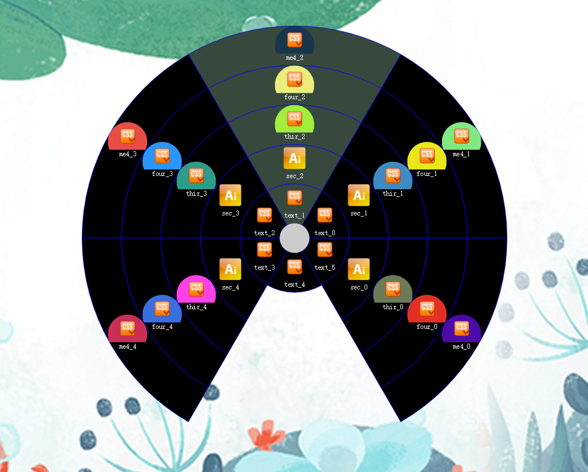

# menus
## Demo
- [Demo1 url](http://htmlpreview.github.io/?https://github.com/kouyjes/annular-menu/blob/master/example/index.html)
- [Demo2 url](http://htmlpreview.github.io/?https://github.com/kouyjes/annular-menu/blob/master/example/index-default.html)


## Getting Started
### Interfaces
```javascript
    interface MenuConfig {
        angle?:number; // define menu radian eg:Math.PI / 6
        callback?:Function; // called when menu created
    }
    interface Menu extends MenuConfig {
        name:String; // menu name
        caption:String; // menu caption
        html?:String; // menu html content
        icon?:String; // menu icon
        menuList?:MenuList; // subMenu define
    }
    interface MenuList extends MenuConfig {
        items:Menu[]; // menu list
        radiusStep?:number; // whitespace of two arc
        offsetRadius?:number; // distance of two arc
    }
    interface AnnularMenuOption {
        menuList:MenuList;
        centerSize?:number;
        collapsible?:boolean;
        draggable?:boolean;
    }
    interface Point {
        x:number;
        y:number;
    }
    interface EventListeners {
        click:Function,
        mouseover:Function
        menuClick:Function[],
        menuHover:Function[]
    }  
```
### Define Menu data
```javascript
    //second level menu
    var menus_1 = [];
    for(var i = 0;i < 4;i++){
        menus_1.push({
            name: 'M1_' + i,
            caption: 'M1_' + i,
            icon: './image/icon.png',
            angle:Math.PI / 4,
            menuList:{
                radiusStep:5,
                items:[]
            }
        });
    }
    
    // first level menu
    var menus_0 = [];
    for(i = 0;i < 4;i++){
        menus_1.push({
            name: 'M0_' + i,
            caption: 'M0_' + i,
            icon: './image/icon.png',
            menuList:{
                radiusStep:8,
                items:menus_1
            }
        });
    }
```
### Initiate AnnularMenu
```javascript
    var contextMenu = new HERE.UI.AnnularMenu({
      menuList:{
          items:menus_0
      }
    });
```
### Render AnnularMenu
```javascript
    var centerX = document.body.clientWidth / 2,
        centerY = document.body.clientHeight / 2;
    var element = contextMenu.render({
        x:centerX,
        y:centerY
    });
    
    var container = document.querySelector('.menu-container');
    container.appendChild(element);
```
### Event
1. menuClick
2. menuHover
3. click
4. mouseover
```javascript
    contextMenu.addEventListener('menuClick', function (e,menu) {
    });
```
### API 
1. render(position?:Point):SVGElement
2. scale(point?:Point)
3. position(point?:Point)
4. toggleCollapse(collapse?:boolean)
5. toggleVisible(visible?:boolean)
6. addEventListener(type:String, handler:Function)
7. removeEventListener(type:String, handler:Function)